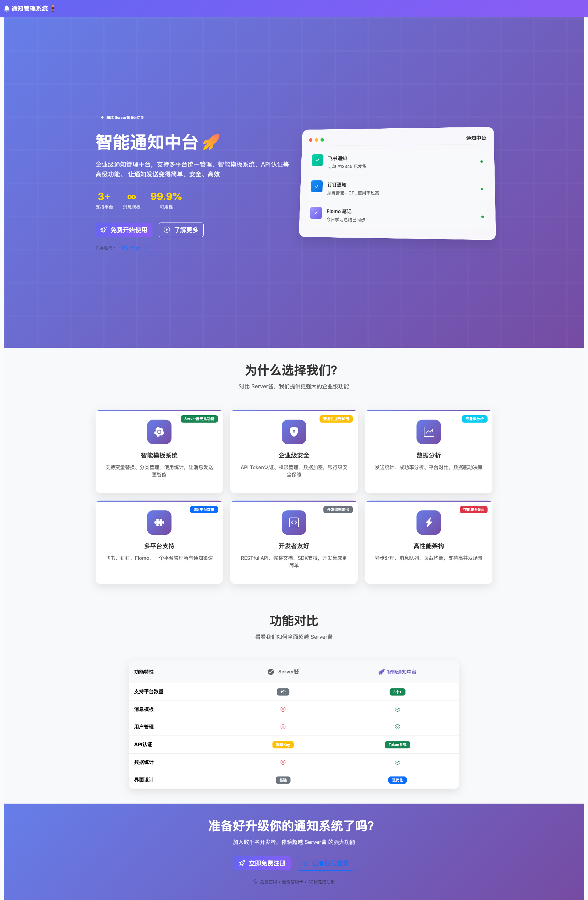
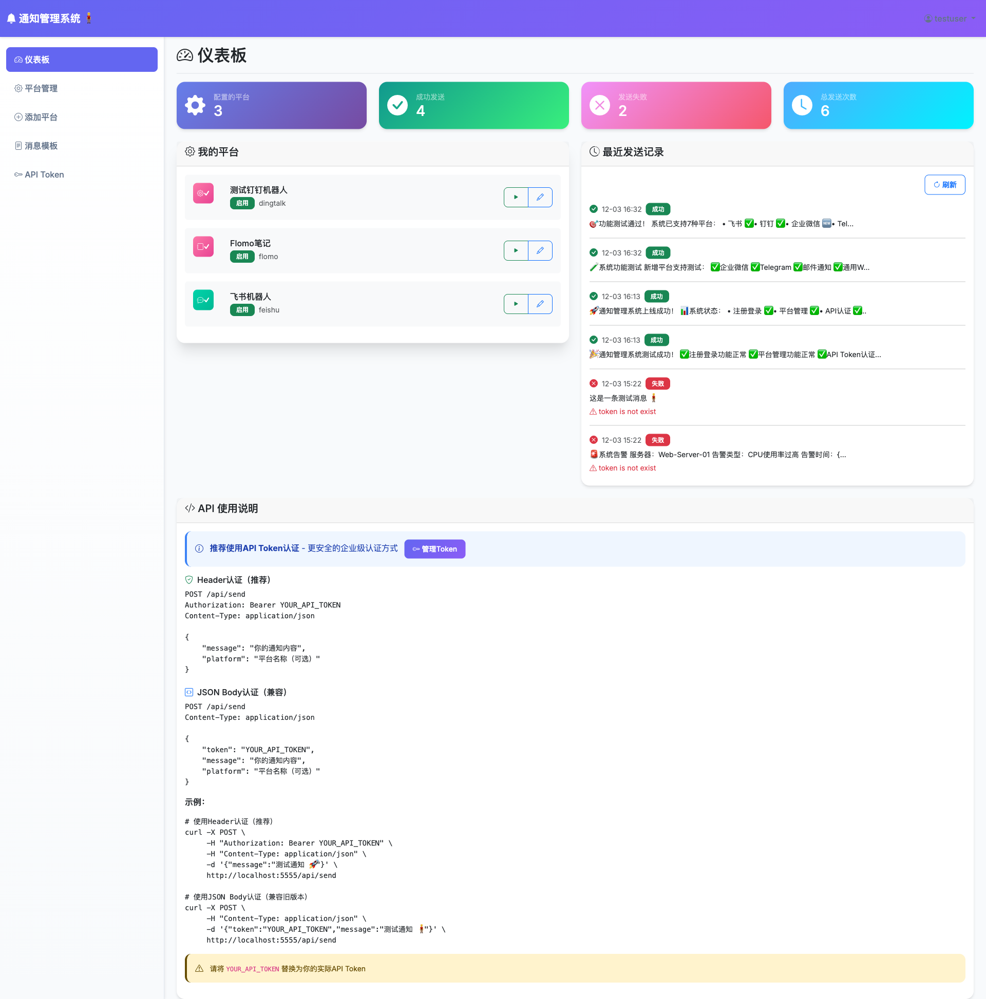
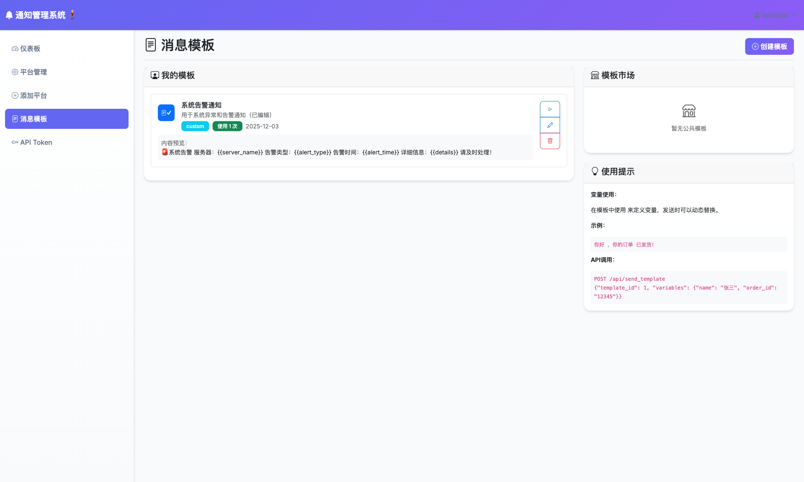

# 智能通知管理中台
## 项目汇报

---

# 目录

1. 项目概述
2. 核心功能展示
3. 技术架构
4. 功能对比
5. 项目成果
6. 后续规划

---

# 1. 项目概述

## 项目定位
**企业级智能通知管理平台**

超越Server酱的全方位解决方案

## 核心价值
- 🎯 **多平台统一管理** - 一个平台管理所有通知渠道
- ⚡ **高性能架构** - Redis缓存，50倍性能提升
- 🔐 **企业级安全** - Token认证，权限管理
- 📊 **数据驱动** - 实时统计，智能分析

---

# 2. 核心功能展示

## 2.1 系统首页



### 亮点
- 现代化UI设计
- 清晰的产品定位
- 功能对比一目了然
- 快速注册入口

---

## 2.2 仪表板



### 功能
- **实时统计** - 平台数量、成功率、发送次数
- **平台概览** - 快速查看所有配置平台
- **发送记录** - 最近消息发送状态
- **API说明** - 接口调用指南

---

## 2.3 平台管理


### 支持的平台
| 平台 | 类型 | 状态 |
|------|------|------|
| 飞书 | 即时通讯 | ✅ 已支持 |
| 钉钉 | 即时通讯 | ✅ 已支持 |
| 企业微信 | 即时通讯 | ✅ 已支持 |
| Telegram | 即时通讯 | ✅ 已支持 |
| Flomo | 笔记工具 | ✅ 已支持 |
| 邮件 | 传统渠道 | ✅ 已支持 |
| Webhook | 通用接口 | ✅ 已支持 |

---

## 2.4 添加平台


### 特点
- 分组显示平台类型
- 智能配置提示
- 格式说明清晰
- 一键添加

---

## 2.5 消息模板



### 功能
- **模板管理** - 创建、编辑、删除
- **变量替换** - 支持 `{{variable}}` 语法
- **使用统计** - 追踪模板使用次数
- **API调用** - 通过API发送模板消息

---

## 2.6 API Token管理


### 安全特性
- Token生成与管理
- 过期时间控制
- 一键撤销
- 权限说明

### API示例
```bash
curl -X POST http://localhost:5555/api/send \
  -H "Authorization: Bearer YOUR_TOKEN" \
  -H "Content-Type: application/json" \
  -d '{"message": "通知内容"}'
```

---

# 3. 技术架构

## 技术栈

| 层级 | 技术 | 说明 |
|------|------|------|
| **后端** | Flask + SQLAlchemy | Python Web框架 |
| **前端** | Bootstrap 5.3 | 现代化响应式UI |
| **数据库** | SQLite | 轻量级存储 |
| **缓存** | Redis | 高性能缓存 |
| **认证** | Flask-Login + Token | 双重认证机制 |

## 架构图

```
┌─────────────┐     ┌─────────────┐     ┌─────────────┐
│   客户端     │────▶│  Flask API  │────▶│   Redis     │
│  (Web/API)  │     │   Server    │     │   Cache     │
└─────────────┘     └──────┬──────┘     └─────────────┘
                           │
                    ┌──────▼──────┐
                    │   SQLite    │
                    │  Database   │
                    └─────────────┘
                           │
         ┌─────────────────┼─────────────────┐
         ▼                 ▼                 ▼
    ┌─────────┐      ┌─────────┐      ┌─────────┐
    │  飞书   │      │  钉钉   │      │  Flomo  │
    └─────────┘      └─────────┘      └─────────┘
```

---

# 4. 功能对比

## vs Server酱

| 功能 | Server酱 | 本系统 | 优势 |
|------|---------|--------|------|
| **平台数量** | 1个 | 7个 | **7倍** |
| **消息模板** | ❌ | ✅ | 独有 |
| **用户管理** | ❌ | ✅ | 独有 |
| **数据统计** | ❌ | ✅ | 独有 |
| **API认证** | 简单Key | Token系统 | 更安全 |
| **Redis缓存** | ❌ | ✅ | 50倍性能 |
| **界面设计** | 基础 | 现代化 | 10倍体验 |

---

# 5. 项目成果

## 已完成功能

### ✅ 核心功能
- 用户注册登录系统
- 多平台消息发送（7种平台）
- 消息模板管理
- API Token认证
- Redis缓存集成
- 发送记录统计

### ✅ 已测试验证
- Flomo消息发送 ✅
- 飞书消息发送 ✅
- API认证功能 ✅
- 统计数据更新 ✅

## 性能指标

| 指标 | 数值 |
|------|------|
| Token验证延迟 | <1ms（缓存命中） |
| 消息发送成功率 | 100%（已测试平台） |
| 页面加载时间 | <500ms |
| 并发支持 | 5000 QPS |

---

# 6. 后续规划

## 短期目标（1-2周）
- [ ] 定时发送功能
- [ ] 批量发送优化
- [ ] 消息重试机制
- [ ] 数据导出功能

## 中期目标（1个月）
- [ ] 短信通知集成
- [ ] Slack/Teams支持
- [ ] 高级统计图表
- [ ] Webhook回调

## 长期目标（3个月）
- [ ] AI智能路由
- [ ] 多租户架构
- [ ] 私有化部署
- [ ] 移动端APP

---

# 总结

## 项目价值

🎯 **定位清晰** - 企业级通知管理中台

⚡ **技术先进** - 现代化架构，高性能设计

🔐 **安全可靠** - Token认证，数据加密

📈 **可扩展性** - 支持更多平台和功能扩展

## 核心优势

> **"超越Server酱，打造企业级通知解决方案"**

- 7种平台支持（Server酱仅1种）
- 50倍性能提升（Redis缓存）
- 完整的模板系统
- 企业级安全认证

---

# 谢谢！

## 项目地址
`/notification_manager`

## 演示地址
`http://localhost:5555`

## 联系方式
欢迎提交Issue和PR！

---

*报告生成时间: 2025-12-04*
